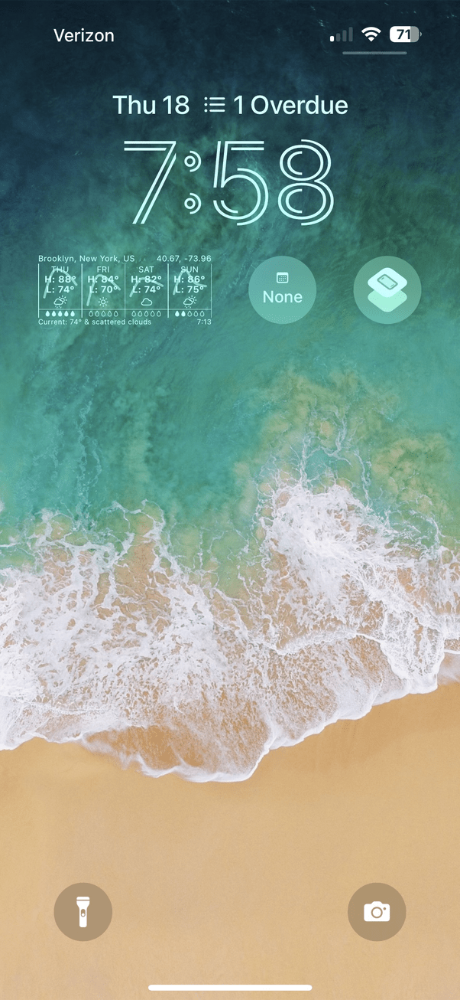
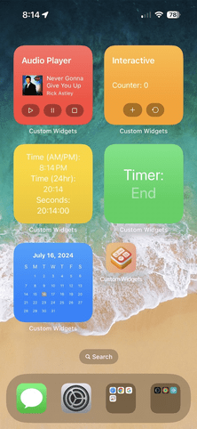
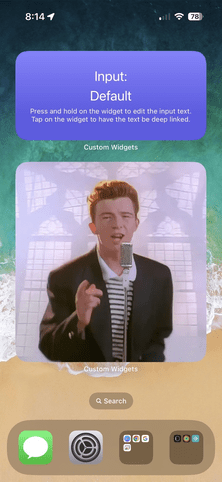

# Custom Widgets

## About
I wanted to create a fancy weather widget for my Lock Screen using OpenWeatherMap's [API](https://openweathermap.org/api), however, I didn't know where to start, so I created all these other (simpler) widgets to learn how to make them and also explore their different capabilities. If you like this app or found it useful, I would appreciate if you starred it or even shared it with your friends. I also don't expect to work on this too much more, as I am quite satisfied with the end result.

## Acknowledgments
Some of the widgets are heavily inspired by [pawello2222's](https://github.com/pawello2222/WidgetExamples) example widgets. However, I have modified a good bit of the syntax such that their widgets are simpler and more concise. Additionally, the fancy weather widget I mentioned earlier was inspired by the [Windy](https://apps.apple.com/us/app/windy-com-weather-radar/id1161387262) weather app's lock screen widget, however, I have improved upon it by adding more detail.

## Usage
If you would like to use the weather widget, you will need your own OpenWeatherMap API token. You can get one [here](https://home.openweathermap.org/subscriptions/unauth_subscribe/onecall_30/base), which allows for up to free 1000 calls a day, and any additional calls are very cheap. However, 1000 calls is more than this app will ever make, given that it only updates every half an hour for a max of 50 times a day. Also, you must ensure this app and widgets have access to your location such that the weather widget can display the local weather. If the app is unable to determine your location, it will just fall back to New York City. You should be prompted to share your location with the app upon the first install.  
The app itself does not have a ton of functionality. There are four pages that you can swipe between, the first of which is a list of all the widgets and a brief overview of their functionalities. Please see the list below for the full details and functionalities of each specific widget. The second screen is a brief tutorial on how to add widgets to your home screen, with a link to Apple's full guide as well. The third screen is where the text that can be deep linked will be displayed, along with the app icons in their different rendering modes. The last screen has your current location, including latitude, longitude, and accuracy. There is a large map, with the place name using the reverse geolocation API underneath. 

## List
There are 8 widgets total, 7 for your home screen and 1 for your lock screen. Screenshots of all widgets are at the top of this file.

#### Home Screen
* Audio Widget - Play and pause music directly in the background. There is no need to even open the app. The default song is none other than Never Gonna Give You Up by Rick Astley, but this can easily be changed by replacing `song.mp3` inside of `Resources`.
* Count Widget - Interact with buttons to increment or reset a counter. The data is saved locally such that even if the widget is removed, the counter will still persist. Created to learn about App Intents and interactive widgets.
* Clock Widget - Display a clock that shows the time in various formats, including in 12 and 24 hour time and also with seconds. Created to learn about updating entries at a scheduled time, in this case, every minute.
* Timer Widget - Displays the time counting down from 1 minute. The time turns red when there are only 10 seconds left, and once it has ended, the text switches to the word "end". It's kind of an evolution of the clock widget above.
* Month Widget - Displays the current month with dates, where the current one is highlighted. Created to familiarize myself with LazyVGrids and recreate a native widget, but with control over the design and formatting.
* Input Widget - Displays inputted text that can be deep linked. Press and hold on the widget to edit the input text. Tap on the widget to have the text be deep linked and show up within the main app. Created to learn about configuration intents.
* Image Widget - Displays an image in the biggest possible widget format, large. Since the audio widget plays Never Gonna Give You Up, this widget fittingly displays an image of Rick Astley from the music video. The image can also be swapped out.

#### Weather Widget
* A lock screen widget that displays the 4-day weather forecast for your current location, which is in the top left of the widget. The top right shows your location, but in latitude and longitude, pulled directly from Apple's location services. Note that while the reverse geolocation may fail and thus the placename is incorrect, the coordinates should still update, and it is the coordinates that are used to fetch the weather. The bottom left shows the current temperature and conditions, something Windy's widget does not have. The bottom right also shows the time since the weather was last fetched. Each fetch occurs ~30 minutes after the previous one.
* If the app is unable to fetch the most recent weather because your device is in airplane mode or not connected to Wi-Fi/cellular, it will keep on displaying the weather from the last successful fetch for up to 6 hours, while continuing to try to fetch the weather. The current temperature will expire after three hours after the last successful fetch. Once the full 6 hours have passed, the weather data will display as null, where everything is 0 and there are ?s for the condition. It will still continue trying to refetch the weather until the data is no longer null.
* The middle section of the widget is split into four sections, with each one corresponding to a subsequent day. Below the day of the week are the high and low temperatures for that day, as well as the average condition expected. Underneath that is the percentage chance that it will rain, where one filled raindrop means that there is an additional 20% chance for rain. If none of the raindrops are filled, it should be a day without rain. I have found this to sometimes be slightly inaccurate. This is not an issue with my code but with the data received from the API call.
* The squiggly line behind each day is a rough approximation of what the temperature will look like throughout the day, starting in the morning and extending into the night. Please note that even though it is only interpolating the four data points from the API, I have found it to still be quite accurate.
* You can choose whether the weather (haha) displays in Celsius or Fahrenheit. To do this, tap on the widget while customizing your lock screen. This will invoke a menu to select your preferred unit. In this same menu, you can also have the weather use a custom location instead of your current one. Simply enable the toggle and type in your desired coordinates. If they are invalid, the fall back location is also New York City.

## Improvements
I know that I said I wouldn't update this app more, but I did anyway, so here are a list of the most recent changes:
* The design of the month widget has been brought more inline with the native one.
* All of the widgets have been updated to render better with tinted appearances.
* The app icon has been simplified to take full advantage of the new liquid glass.
* You no longer need to manually input your OpenWeatherMap API key into the code, as it can now be set using App Intents in the same menu as the weather unit and location.

## Installation
1. Clone this repository or download it as a zip folder and uncompress it.
2. Open up the `.xcodeproj` file, which should automatically launch Xcode.
3. You might need to change the signing of the app from the current one.
4. If it is not already selected, choose the `WidgetsExtension` scheme.
5. Click the `Run` button near the top left of Xcode to build and install.
6. To add/view the widgets, please refer to Apple's official [support guide](https://support.apple.com/en-us/118610).

#### Prerequisites
Hopefully this goes without saying, but you need Xcode, which is only available on Macs.

#### Notes
You can run this app on the Xcode simulator or connect a physical device.  
The device must be either an iPhone or iPad running iOS 26.0 or newer.

## SDKs
* [SwiftUI](https://developer.apple.com/xcode/swiftui/) - Helps you build great-looking apps across all Apple platforms.
* [WidgetKit](https://developer.apple.com/documentation/widgetkit) - Extend the reach of your app by creating widgets.
* [AppIntents](https://developer.apple.com/documentation/appintents) - Make your app’s actions discoverable with system experiences.
* [Charts](https://developer.apple.com/documentation/charts) - Construct and customize charts on every Apple platform.
* [CoreLocation](https://developer.apple.com/documentation/corelocation/) - Obtain the geographic location and orientation of a device.
* [Combine](https://developer.apple.com/documentation/combine) - Customize handling of asynchronous events using event-processing.

## Bugs
If you find any, feel free to open up a new issue or even better, create a pull request fixing it.

#### Known
- [x] App may crash when it is unable to determine device location, such as on an airplane.
- [ ] App is laggy/stutters when swiping to the location page because the map may be loading.

## To-Do List
- [x] Update app icons to support iOS 18 appearances
- [x] Add the ability to set a custom weather location
- [x] Improve the user interface of the main app itself
- [x] Have the API Key be inputted using App Intents
- [ ] Show question marks instead of 0s for null data

## Contributors
Sachin Agrawal: I'm a self-taught programmer who knows many languages and I'm into app, game, and web development. For more information, check out my website or Github profile. If you would like to contact me, my email is [github@sachin.email](mailto:github@sachin.email).

## License
This package is licensed under the [MIT License](LICENSE.txt).
